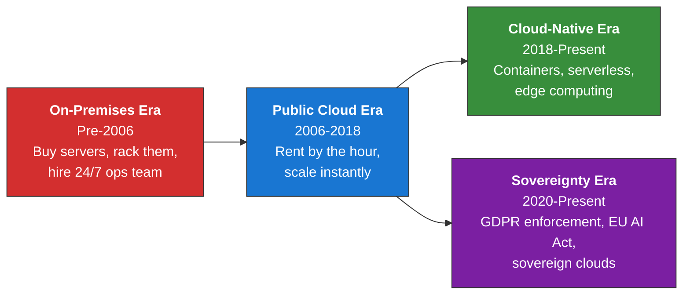
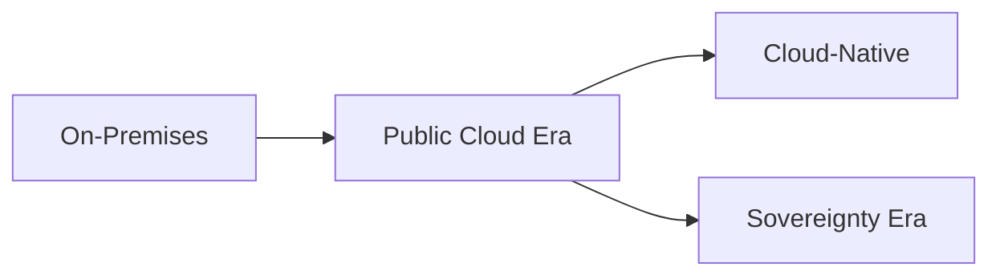

# Expand Outline Skill

Transform outline files (outline/day-N/XX-topic.md) into full teaching content (day-N/XX-topic.md). This skill reads your outline structure, understands your teaching philosophy from CLAUDE.md and reference Day 1 teaching files, and intelligently expands sections into rich, engaging narratives with instructor guidance.

## How to Invoke

```bash
# Expand ONE outline file
/expand-outline outline/day-2/02-alternative-hosting.md

# Expand ALL outline files in a day
/expand-outline outline/day-2

# Auto-detect (if you say "expand the outlines for day 2" in a course project)
Claude will automatically load and invoke this skill
```

## What This Skill Does

1. **Reads the outline file** (outline/day-N/XX-topic.md)
2. **Reads CLAUDE.md** to understand:
   - Your teaching philosophy and style
   - Content expansion guidelines
   - Expected structure and length
   - Domain-specific rules (fact-checking, sovereignty, etc.)
3. **Reads 1-2 Day 1 reference teaching files** to understand:
   - How to expand "Key Concepts" into narrative paragraphs
   - How to weave discussion prompts naturally
   - How to structure instructor notes
   - How to expand case studies across multiple paragraphs
   - Level of detail and voice
   - How to create synthesis sections
4. **Intelligently expands outline structure**:
   - Extracts H1 title, goal, teaching philosophy from outline
   - Expands each H2 section with rich narrative
   - Converts bullet points into engaging prose
   - Creates discussion prompts that spark critical thinking
   - Adds instructor notes (pacing, misconceptions, engagement)
   - Expands case studies into detailed multi-paragraph narratives with numbers
   - Creates synthesis section with key takeaways
   - Adds expected outcomes
5. **Embeds visual placeholders** for instructor-added illustrations
6. **Writes to disk**: `day-N/XX-topic.md`
7. **Supports parallel generation**: If you invoke with `outline/day-N`, detects all outline files and expands each in a parallel agent

## Outline → Content Conversion Patterns

This mapping comes from analyzing Day 1 outline and teaching files side-by-side:

### Outline Structure

A typical outline file has:

```markdown
# 1. [Topic Name] (45 min)

## Scope
[One paragraph describing what this section covers]

## Key Concepts
- Concept 1 (what it is, why it matters)
- Concept 2
- Concept 3

## Learning Path
1. [Foundation]: Explain the foundational idea
2. [Depth]: Go deeper into mechanics and trade-offs
3. [Application]: How does this apply in real projects?

## Discussion Prompt
> *"Quoted question that sparks critical thinking"*

## Hands-On (if applicable)
[Exercise type: discussion, decision matrix, code walkthrough, case study analysis]
[Brief description of what students will do]

## Expected Challenges
- Common misconception: [what students often misunderstand]
- Tricky part: [where students struggle]
- How to address it
```

### Conversion Pattern: Key Concepts → Narrative Paragraphs

**Outline:**
```
## Key Concepts
- On-premises infrastructure (owned hardware, full control, high ops burden)
- Public cloud (rented, instant scale, vendor lock-in risk)
- Hybrid cloud (mix of both, "worst of both worlds" complexity)
```

**Expanded to teaching content:**
```markdown
### The Four Primary Hosting Models

The landscape today is defined by four distinct postures a company can take
regarding its infrastructure:

**On-Premises / Sovereign Bare Metal** means your infrastructure is owned,
leased, or managed by the organization in a private facility. This gives you
absolute control over data and predictable flat-rate costs at scale, which is
critical for adhering to strict national regulations (like French HDS
certification). But the trade-offs are severe: immense upfront investment,
requiring dedicated infrastructure engineering teams, and slow provisioning of
new capacity. You see this in banks, government agencies, defense contractors,
and highly regulated healthcare organizations.

**Public Cloud** (AWS, Azure, GCP) lets you rent infrastructure over the internet
with rapid elasticity and global reach. The appeal is obvious: scale from 1 user
to 1 million in days without buying hardware. But you inherit two risks: vendor
lock-in (migrating away costs millions and takes years) and data privacy concerns
(US CLOUD Act exposure). This model dominates high-growth startups and SaaS
platforms.

**Hybrid Cloud** is a deliberate mix: sensitive data stays on-premise, volatile
web traffic or heavy analytics go to the public cloud. The theory is elegant —
balance the security of private infrastructure with the burst capacity of the
cloud. But in practice, it becomes "the worst of both worlds" complexity. You
need networking expertise to bridge data centers securely, and every component
becomes harder to debug. Expanding enterprises and legacy companies in transition
attempt this model, but few manage it cleanly.
```

**Key principles:**
- Turn bullet points into full sentences with context
- Add "why this matters" explanations
- Include concrete examples (who uses this, when)
- Explain trade-offs (what worked, what didn't)
- Use narrative voice, not list format

### Conversion Pattern: Learning Path → Section Subsections

**Outline:**
```
## Learning Path
1. Foundation: Explain why the cloud era started
2. Depth: Compare hosting models on cost, control, and scale
3. Application: Real company examples (Doctolib, Qonto, Mistral)
```

**Expanded to teaching content:**

The outline's learning path becomes your section structure:

```markdown
### The Evolution: Why We Moved to the Cloud

[Narrative expanding "Foundation" - why on-premises became unsustainable]

[Mermaid diagram showing era timeline]

### The Four Primary Hosting Models

[Narrative expanding "Depth" - detailed comparison of each model]

### Case Studies: Real-World Architecture Choices

[Narrative expanding "Application" - concrete examples with numbers]
```

**Key principles:**
- Each learning path item becomes an H3 subsection
- Foundation explains the history and context
- Depth goes into mechanics and trade-offs
- Application uses real case studies with concrete numbers

### Conversion Pattern: Case Studies → Multi-Paragraph Narratives

**Outline mentions:**
```
## Learning Path
3. Application: Real company examples (Doctolib, Qonto, Mistral)
```

**Expanded to teaching content:**

```markdown
#### Case 1: Doctolib — Sovereign Cloud for Healthcare

- **The Company:** Founded in 2013, Doctolib is Europe's leading e-health
  booking platform. By 2024, it served 80 million patient accounts and over
  400,000 healthcare professionals across France, Germany, and Italy, generating
  over EUR 400M in annual revenue.

- **The Constraint:** European health data is among the most regulated in the
  world. In France, hosting providers must hold the HDS (*Hebergeur de Donnees
  de Sante*) certification — Doctolib obtained it in November 2021. Placing
  patient data on US-owned servers exposes it to the extra-territorial reach
  of the US CLOUD Act, a legal risk that French medical associations challenged
  in court.

- **The Decision:** AWS Paris Region with encryption-at-rest keys managed by
  Atos (now Eviden) on Doctolib's behalf — not by Amazon. This hybrid approach
  uses the scale of a hyperscaler while keeping cryptographic control sovereign.
  Privacy overrides ease of use.

- **The Lesson:** Using a US hyperscaler in Europe is a calculated risk, not a
  solved problem. Encryption and key management mitigate data access risks, but
  operational sovereignty requires infrastructure owned and operated by entities
  outside US jurisdiction. This is why SecNumCloud certification and EU sovereign
  cloud initiatives exist.
```

**Key principles:**
- Convert each bullet point into a full paragraph
- Include specific numbers (company size, revenue, timeline)
- Explain the constraint clearly (the tension they faced)
- Describe the decision and why it was chosen
- Extract the lesson (what we learn from this choice)
- Use real company names, dates, and financials

### Conversion Pattern: Discussion Prompt → Natural Flow Integration

**Outline:**
```
## Discussion Prompt
> *"OVHcloud and Scaleway have existed for years. Why did it take GDPR
> and Schrems II for European companies to start taking them seriously?"*
```

**Expanded to teaching content:**

Don't just drop the prompt. Embed it naturally after narrative content:

```markdown
The enforcement of GDPR (2018), Schrems II (2020), and the EU AI Act (2024)
made data sovereignty a board-level concern. Sovereign cloud providers like
OVHcloud, Clever Cloud, and Scaleway emerged as credible alternatives for
EU-regulated workloads.

> **Discussion prompt:** *"OVHcloud, Scaleway, and Clever Cloud have existed
> for years. Why did it take GDPR and Schrems II — not better technology —
> for European companies to start taking them seriously?"*
```

**Key principles:**
- Place discussion prompt after the narrative that motivates it
- Use blockquote format with leading > and bold "Discussion prompt:"
- Keep the quoted question exactly as in the outline
- Ensure the preceding paragraph sets up why the question matters

### Conversion Pattern: Expected Challenges → Instructor Notes

**Outline:**
```
## Expected Challenges
- Common misconception: Students think encryption protects against CLOUD Act
  exposure
- Tricky part: Explaining operational vs. data sovereignty
- How to address: Give a concrete example (if US govt compels AWS to shut down,
  encryption keys don't help)
```

**Expanded to teaching content:**

This becomes an `### Instructor Notes:` block at the end of the section:

```markdown
### Instructor Notes: Sovereignty & Compliance

> **Pacing:** Spend 5-7 minutes on this section. The key insight is the
> difference between data encryption (protects content) and operational
> sovereignty (protects availability). Don't get bogged down in legal details.
>
> **Common misconception:** Students often think "if data is encrypted, the
> CLOUD Act can't touch it." False. Encryption protects content from being
> *read*, but not from being *blocked*. If the US government compels AWS
> to deny service, your data is inaccessible whether it's encrypted or not.
>
> **Engagement tip:** Ask: "If the US government tells AWS to shut off all
> service to Iran tomorrow, what happens to an Iranian SaaS company running
> on AWS, even with encrypted data?" This makes the sovereignty risk concrete.
>
> **Visual aid:** A simple diagram showing "Encryption protects content" vs.
> "Sovereignty protects availability" would help clarify.
```

**Key principles:**
- Convert Expected Challenges into Instructor Notes subsections
- Group pacing, misconceptions, and engagement tips into structured notes
- Instructor notes always follow the narrative section they apply to
- Use blockquote format (>) for notes

### Conversion Pattern: Scope → Goal & Teaching Philosophy

**Outline:**
```
# 1. Understanding Hosting Models (90 min)

## Scope
This section equips students with foundational mental models to compare and
select hosting architecture based on business constraints, team maturity, and
regulatory requirements.
```

**Expanded to teaching content header:**

```markdown
# 1. Understanding Hosting Models (90 min)

**Goal:** Equip students with the foundational mental models to compare and
select the right hosting architecture based on business constraints, team
maturity, and regulatory requirements.

**Teaching Philosophy:** Moving code from a laptop to the internet is no longer
just a technical challenge—it's a business, legal, and financial decision. We
are not here to memorize acronyms (IaaS, PaaS, SaaS) but to understand the
*trade-offs* inherent in shifting responsibility from your team to a vendor.
Every abstraction layer you buy saves time but costs money and hides control.
```

**Key principles:**
- Goal is one sentence (from scope)
- Teaching Philosophy is 2-3 sentences explaining the "why" and the narrative arc
- Philosophy explains how this fits the broader course narrative
- Philosophy reveals your biases (e.g., "we care about trade-offs, not acronyms")

### Mermaid Diagram Handling

**Outline mentions:**
```
## Learning Path
1. Evolution: Show era timeline (on-premises → cloud → cloud-native → sovereignty)
```

**Expanded to teaching content:**

If the outline mentions a diagram, create a Mermaid diagram:

```markdown
### The Evolution: Why We Moved to the Cloud



**Key principles:**
- Use only the approved color palette: #d32f2f, #1976d2, #388e3c, #7b1fa2, #f57c00, #e64a19
- Use `graph LR` (left-right) for landscape diagrams
- Use `graph TD` (top-down) only for tall, narrow diagrams
- Keep labels short and clear
- Use HTML formatting for multi-line labels (`<b>`, `<br/>`)

### Visual Placeholders

Throughout the expanded content, add visual placeholders where illustrations would help:

```markdown
*Visual:* A timeline showing cloud evolution from on-premises to sovereignty eras,
with key companies and technologies marked at each era.
```

**Key principles:**
- Describe what visual would enhance understanding
- Be specific (not just "diagram" but "timeline showing X")
- Place before synthesis or after complex narrative
- These become speaker notes in generated slides (<!-- *Visual:* ... -->)

## Processing Steps

1. **Check prerequisites**: CLAUDE.md must exist
2. **Detect input**:
   - If file path provided (outline/day-2/02-topic.md), expand that ONE file
   - If directory provided (outline/day-2), detect all outline/*.md files and expand each
3. **For each outline file**:
   - Read the outline structure
   - Extract: H1 title, Scope, Key Concepts, Learning Path, Discussion Prompt, Expected Challenges
   - Read CLAUDE.md (content expansion guidelines, domain rules)
   - Read 1-2 Day 1 teaching files to calibrate style, depth, and voice
   - Expand outline to full teaching content:
     - Create H1 header with Goal and Teaching Philosophy
     - Expand each Learning Path item to H3 subsection
     - Convert Key Concepts bullets → narrative paragraphs
     - Add discussion prompts naturally
     - Expand case studies → multi-paragraph narratives with numbers
     - Add Mermaid diagrams where appropriate
     - Convert Expected Challenges → Instructor Notes blocks
     - Create Synthesis: Key Takeaways section
     - Add Expected Outcomes bulleted list
     - Include visual placeholders
   - Write to `day-N/XX-topic.md`
4. **Report**: Show what was expanded

## Content Expansion Guidelines (From CLAUDE.md)

When expanding, follow these standards (read from CLAUDE.md):

**Structure:**
- H1 title: `# N. Title (XX min)` — always include minutes, never hours
- **Goal** paragraph (1 sentence)
- **Teaching Philosophy** paragraph (2-3 sentences)
- Numbered H2 sections for lectures: `## 1. Topic (XX min)`
- `### Instructor Notes: [Section Name]` as H3, content in blockquotes
- Discussion prompts as `> **Discussion prompt:** *"quoted text"*`
- `## Synthesis: Key Takeaways` section
- `## Expected Outcomes` bulleted list

**Style:**
- Rich narrative framing ("why it existed → what worked → what didn't → when it still makes sense")
- Em-dashes (—), never double-hyphens (--)
- No emojis
- Duration in headings: `(15 min)`, `(105 min)` — NOT hours, NOT clock times

**Content:**
- Mermaid diagrams with color palette: #d32f2f, #1976d2, #388e3c, #7b1fa2, #f57c00, #e64a19
- Real case studies with concrete numbers (company, tech stack, timeline, financial data, outcome)
- Instructor notes per subsection (pacing, misconceptions, engagement tips)
- Discussion prompts embedded in narrative flow
- Visual placeholders
- Domain-specific rules (if applicable: fact-checking, sovereignty focus, etc.)

## Parallel Generation

If invoked with `/expand-outline outline/day-2`:
1. Detect all files in `outline/day-2/01-*.md`, `outline/day-2/02-*.md`, etc.
2. Launch one parallel agent per file (in isolated git worktrees)
3. Each agent independently:
   - Reads the outline file
   - Reads CLAUDE.md
   - Reads Day 1 reference teaching files
   - Expands to full teaching content
   - Writes to `day-N/XX-topic.md`
4. Collect results and report on all expanded files

## Coherency Checks (After Parallel Expansion)

If multiple files were expanded in parallel:
1. Verify all files follow the same structure (H1, Goal, Philosophy, H2 sections, Synthesis, Outcomes)
2. Check that all discussion prompts use consistent format
3. Confirm instructor notes format is consistent (blockquotes)
4. Verify Mermaid color palette matches across all files
5. Alert user to any inconsistencies

## Example: Full Outline → Expanded Section

**Outline:**
```markdown
# 1. Understanding Hosting Models (90 min)

## Scope
Equip students with foundational mental models to compare and select hosting
architecture based on constraints, team maturity, and regulations.

## Key Concepts
- On-premises infrastructure (owned hardware, full control, high ops burden)
- Public cloud (rented, instant scale, vendor lock-in risk)
- Hybrid cloud (mix, "worst of both worlds" complexity)
- Multi-cloud (distributed across providers, avoid lock-in but complex)

## Learning Path
1. Evolution: Why we moved to the cloud
2. Models: Detailed comparison of each model
3. Trade-offs: Real company examples

## Discussion Prompt
> *"Why did sovereign cloud providers take off after GDPR, not before?"*

## Expected Challenges
- Misconception: Encryption solves CLOUD Act exposure
- Tricky part: Operational vs. data sovereignty
- Engagement: Ask what happens if US govt blocks AWS service

## Hands-On
Decision matrix exercise: students evaluate hosting models for scenarios
```

**Becomes teaching content:**
```markdown
# 1. Understanding Hosting Models (90 min)

**Goal:** Equip students with foundational mental models to compare and select
the right hosting architecture based on business constraints, team maturity,
and regulatory requirements.

**Teaching Philosophy:** Moving code from a laptop to the internet is no longer
just a technical challenge—it's a business, legal, and financial decision. We
are not here to memorize acronyms (IaaS, PaaS, SaaS) but to understand the
*trade-offs* inherent in shifting responsibility from your team to a vendor.

## 1. Overview of Hosting Models (30 min)

### The Evolution: Why We Moved to the Cloud

To understand modern hosting, we have to look at why it evolved.

[Detailed narrative about on-premises era, why it failed, when cloud emerged...]



### The Four Primary Hosting Models

On-Premises infrastructure means... [full narrative with trade-offs]

Public Cloud (AWS, Azure, GCP) lets you... [narrative with examples]

Hybrid Cloud is... [narrative with use cases]

Multi-Cloud means... [narrative with why it's complex]

> **Discussion prompt:** *"Why did sovereign cloud providers take off after
> GDPR, not before?"*

### Instructor Notes: Hosting Model Concepts

> **Pacing:** 25 minutes total (5 min per model + 5 min discussion)
> **Common misconception:** Students think cost is the main difference. Emphasize
> that operational burden and sovereignty are equally important.
> **Engagement tip:** Ask students: "Which model would you choose for a fintech
> startup? A government agency? A startup in France vs. Singapore?"

## Synthesis: Key Takeaways

- Hosting models are defined by who controls what
- Trade-offs matter more than features
- Sovereignty and regulation increasingly drive decisions
- No single "best" model; it depends on constraints

## Expected Outcomes

Students will be able to:
- Explain the four primary hosting models and their trade-offs
- Identify which model fits different business constraints
- Evaluate hosting decisions through cost, control, and compliance lenses
- Recognize when companies choose "wrong" models and why they later migrate
```

## Error Handling

**CLAUDE.md missing:**
```
❌ Cannot expand outlines — CLAUDE.md not found.

This skill requires a bootstrapped project. Run:
  /course-bootstrap

...to create CLAUDE.md and project structure.
```

**Outline file not found:**
```
❌ File not found: outline/day-2/02-topic.md

Check the file path. Available outline files in outline/day-2/:
- outline/day-2/01-cloud-provider-comparison.md
- outline/day-2/02-alternative-hosting.md
```

**Outline format invalid:**
```
⚠️  Outline file structure incomplete: outline/day-1/01-topic.md

Expected outline structure:
- H1 title with duration
- ## Scope section
- ## Key Concepts
- ## Learning Path
- ## Discussion Prompt (optional)
- ## Expected Challenges (optional)

Fix the outline format and try again.
```

## Success Report

```
✅ Outlines expanded successfully!

Expanded:
- outline/day-2/01-cloud-provider-comparison.md → day-2/01-cloud-provider-comparison.md
- outline/day-2/02-alternative-hosting.md → day-2/02-alternative-hosting.md
- outline/day-2/03-hands-on-cloud-provider-choice.md → day-2/03-hands-on-cloud-provider-choice.md

Total: 3 teaching files created (approx. 4,200 lines)

Next steps:
1. Review the generated teaching files in day-2/
2. Add factual details and company data (numbers, dates, certifications)
3. Generate slides: /generate-slides day-2
4. Create exercises: /create-exercises day-2/03-hands-on.md
```

## Content Review Checklist

After expansion, verify:
- [ ] H1 title matches outline
- [ ] Goal is one clear sentence
- [ ] Teaching Philosophy is 2-3 sentences and explains "why this matters"
- [ ] Each Learning Path item is an H3 subsection
- [ ] Key Concepts are expanded into full narrative paragraphs
- [ ] Discussion prompts are embedded naturally (not dropped randomly)
- [ ] Case studies have: Company, Constraint, Decision, Lesson
- [ ] Case studies include concrete numbers (revenue, timeline, scale)
- [ ] Mermaid diagrams use only approved colors and LR orientation
- [ ] Instructor Notes follow each major section
- [ ] Instructor Notes include: Pacing, Common misconception, Engagement tip
- [ ] Synthesis: Key Takeaways section exists
- [ ] Expected Outcomes are bulleted and measurable
- [ ] Visual placeholders are present where helpful
- [ ] Em-dashes used (—), not double-hyphens (--)
- [ ] No emojis
- [ ] Duration in headings in minutes, not hours
